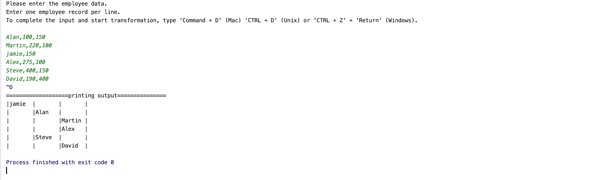

# momenton-test
Given employee data in a csv form, this utility will print out the organization hierarchy in format below:





## Example usage

Invocation can be through a plain text file containing employee data, one per line with command below

```sh
java -jar momenton-orgchart-<version>.jar [commands.txt]
```
OR If no file is provided, commands(employee details) are read from `sdtin` 

`java -jar momenton-orgchart-<version>.jar` 

`Please enter the employee data.
Enter one employee record per line.
To complete the input and start transformation, type 'Command + D' (Mac) 'CTRL + D' (Unix) or 'CTRL + Z' + 'Return' (Windows).
`

Example usage without a file is below:


The sequence expected for employee details is `name,id,managerId` as per the problem statement.

## Getting Started

### Build

To build the project, just run `mvn clean package`.
The built JAR along with sample inputs can be found in the `./target/` directory.

### Test

Building with `mvn clean package` already runs the unit tests.

`mvn clean verify` would also run integration tests, but none are present as of yet.
